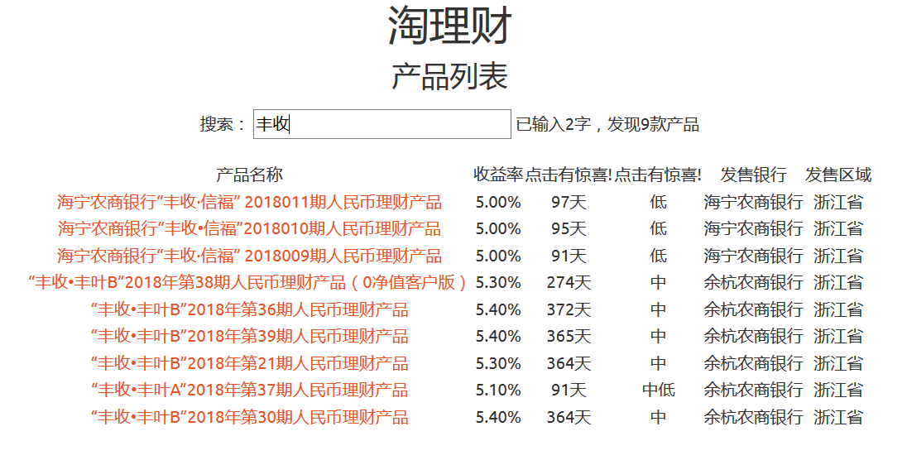
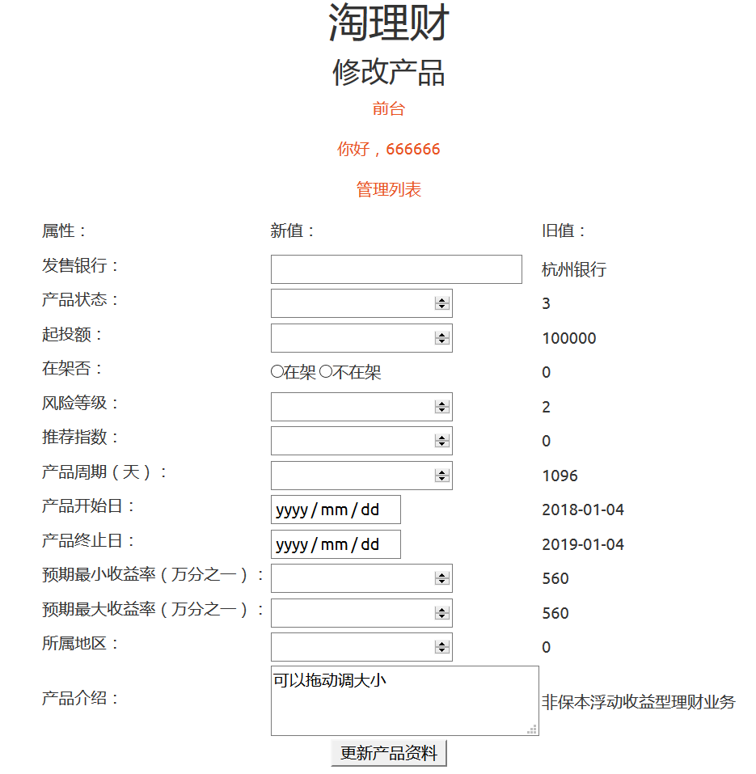

# egg淘理财是一个理财产品查询网站，使用laravel开发, 用于快速学习laravel.  

项目名称：egg  
使用组件：wnmp(windows nginx mysql php) composer  
使用框架：laravel  
  
#项目启动  
将egg.sql导入egg数据库，windows环境下可以将wnmp.7z解压至c盘可免去此步骤  
安装composer后，egg上运行命令：  
php artisan key:generate  
php artisan config:cache  
  
添加服务器路由  
nginx server{  
    root html/egg/public;  
}  

启动wnmp，浏览器访问  
前台：http://localhost/  
后台：http://localhost/admin  
  
# laravel目录  
数据库配置在.env  
默认用户 sd\@dsf.com 666666  
Model: egg\app  
Route: egg\routes\web.php  
Controller: egg\app\Http\Controllers  
View: egg\resources\views  
静态资源: egg\public  
github链接：https://github.com/laohur/egg  

前台：http://localhost/  

  
后台：http://localhost/admin  

